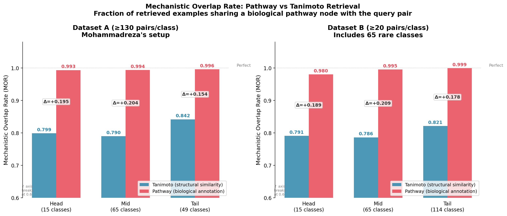
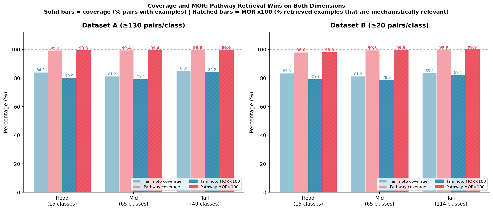
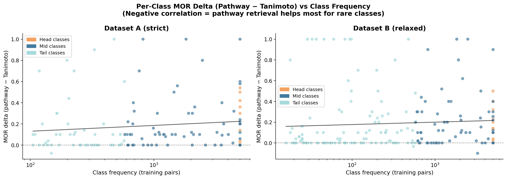
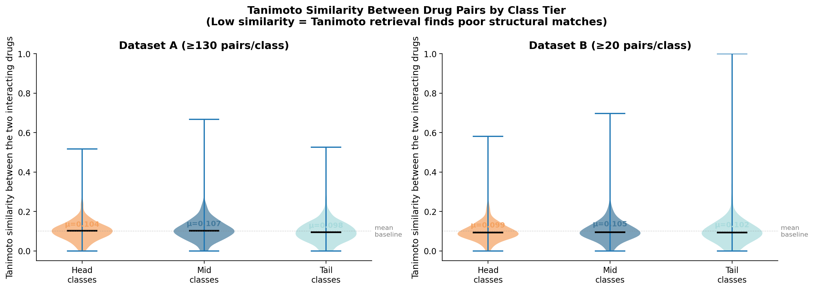
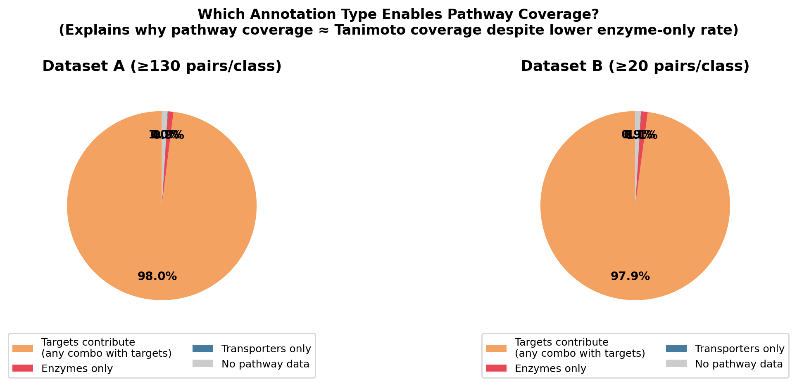
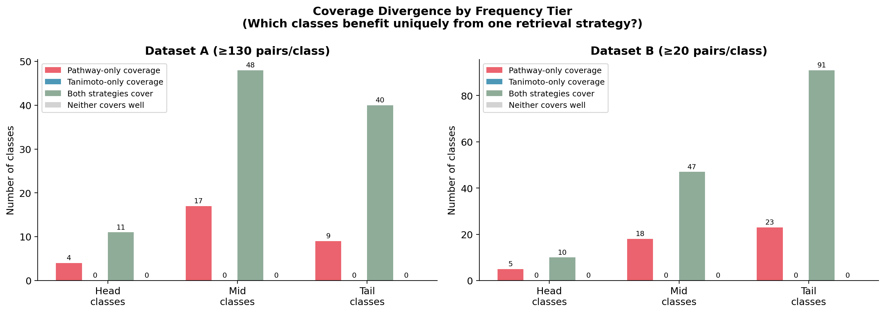

# PharmCoT-RJ: Pathway-Aware Retrieval for Drug-Drug Interaction CoT Distillation

**Rameen Jafri** | University of Guelph | DATA 6400 | April 2026

---

## Background

PharmCoT is a knowledge distillation pipeline for drug-drug interaction (DDI)classification. Given a pair of drugs, the goal is to predict which of 129 fine-grained interaction types applies. For example, "the serum concentration of Drug A can be increased when combined with Drug B", along with a severity label (Major/Moderate/Minor) and a mechanistic explanation of why the interaction occurs.

The pipeline works in three stages. In **Stage 1**, a large language model (Llama-3.3-70B-Instruct) is prompted with a drug pair, its pharmacological profiles from DrugBank, five retrieved example interactions, and the ground-truth interaction label. It produces a structured chain-of-thought trace: a step-by-step mechanistic explanation, a concise summary, and a severity classification. In **Stage 2**, generated traces are filtered by a three-model judge ensemble (OpenBioLLM-70B, TxGemma-27B, Qwen2.5-72B) that scores each trace on factual accuracy, mechanistic depth, and clinical relevance. In **Stage 3**, a smaller model (Qwen3-8B) is fine-tuned via LoRA on the filtered traces. The student learns to produce the same structured mechanistic reasoning at inference time without needing the teacher's scale.

The trained student classifies drug pairs into 129 interaction types while simultaneously generating a clinically interpretable explanation, which conventional classification models cannot do.

My work focuses entirely on Stage 1. All contributions are to the quality of information the teacher receives and the quality of the reasoning traces it produces. The motivation for each contribution is described below, along with the experiments used to test whether the change actually helped.

## Motivation

Stage 1 has three characteristics that could limit the quality of the teacher traces the student learns from. Whether each one actually matters is an empirical question, and testing that is a core part of this work.

### Characteristic 1: The retrieval strategy is based on structural similarity

Before the teacher explains a drug interaction, it is shown five example interactions to provide context. The original pipeline selects these examples using Tanimoto structural similarity: it finds drugs whose molecular fingerprints look similar and assumes they will interact similarly.

Whether structural similarity is a good proxy for mechanistic relevance is not obvious. Drug interactions are determined by biological mechanisms, which enzymes break drugs down, which receptors they bind, which transporters move them across membranes. Structural similarity captures molecular shape, not biological function. Two drugs that look alike can interact through completely different pathways, and two structurally unrelated drugs can interact through exactly the same mechanism.

If structural similarity is a poor proxy for mechanistic relevance, then roughly 1 in 5 examples shown to the teacher could be mechanistically irrelevant to the query pair, potentially misleading its reasoning rather than grounding it.

### Characteristic 2: Severity labels are sparse

Every interaction has a severity label that the student is trained to predict. A diagnostic analysis of the 234,646 existing teacher traces found:

- 83.8% have no severity label at all
- 9.9% have severity labels generated by the teacher model itself, which produces Major 92.4% of the time regardless of the actual interaction
- Only 6.3% have validated severity labels from DDInter, a curated clinical database

The real distribution in validated clinical data is 70% Moderate, 26.5% Major, and 3.5% Minor. Whether the student can learn meaningful severity prediction from this signal is unclear. It may simply learn to always predict Major, or learn nothing at all about severity.

### Characteristic 3: The prompt may be missing pharmacological context

Three pieces of context are absent from the original teacher prompt that could matter for correct mechanistic reasoning.

First, 8.3% of training pairs involve prodrugs, which are pharmacologically inactive until converted to their active form by an enzyme. For these drugs, the direction of enzyme inhibition is reversed compared to a normal drug. Whether the teacher handles this correctly without an explicit flag is an open question.

Second, 75% of drug pairs share no common enzymes, transporters, or targets in DrugBank. For these pairs the teacher has no shared biochemical anchor between the two drugs. Whether this causes it to hallucinate connections or reason correctly from first principles is testable.

Third, the original prompt silently truncates drug profiles at 5 enzymes, 3 transporters, and 3 targets. For heavily metabolised drugs this drops information with no indication that truncation occurred. Whether the missing annotations are pharmacologically important for the interactions being explained is drug and interaction specific.

## My Approach

I made three categories of changes to Stage 1, each motivated by one of the characteristics described above. The changes are described here at a high level. Detailed methods, results, and ablation findings follow in the Experiments and Results section.

### Contribution 1: Pathway-Aware Retrieval

I replaced Tanimoto structural similarity retrieval with biological pathway retrieval. Instead of finding drugs that look structurally similar, the new system finds drugs that share the same enzymes, transporters, or receptors in DrugBank. The hypothesis is that mechanistically similar examples produce better teacher reasoning than structurally similar ones.

To measure whether this hypothesis holds, I defined a new metric called Mechanistic Overlap Rate (MOR) and evaluated both retrieval strategies across 236,000 training pairs in two datasets. The full methods and results are in the Retrieval Quality Experiment section.

### Contribution 2: Prompt Improvements

I made five targeted changes to the teacher prompt, each addressing a specific gap in the pharmacological context the teacher receives. The changes are numbered Fix 1 through Fix 5.

Fix 1 added a PK/PD interaction type flag to tell the teacher whether to reason about ADME mechanisms or receptor effects. Fix 2 added a prodrug warning for pairs where the direction of enzyme inhibition is reversed. Fix 3 raised the drug profile truncation caps to include more enzyme and target annotations. Fix 4 integrated a rule-based severity classifier to replace missing and hallucinated severity labels. Fix 5 added a note for pairs where the two drugs share no common pathway nodes, redirecting the teacher toward pharmacodynamic reasoning.

Each fix was implemented independently so it could be toggled on or off. An ablation study tested fixes 1, 2, 4, and 5 individually. Fix 1 was found to hurt direction accuracy and was subsequently disabled. The full methods, ablation design, and results are in the Ablation Study section.

### Contribution 3: Direction-Aware Evaluation

The existing quality metric in the pipeline is grounded factuality, which checks whether pharmacological entity names in the trace appear in the drug profiles. This metric cannot check whether the teacher reasoned correctly about the direction of an interaction effect, whether drug levels go up or down, whether the prodrug is activated or blocked.

I built a direction-aware scorer that extracts the ground truth direction from the interaction label and checks whether the trace's Summary section states the correct direction. This scorer is what makes the prompt improvements measurable. Without it, the prodrug warning and severity classifier produce no detectable signal because grounded factuality is insensitive to directional correctness.

## Experiments and Results

### Retrieval Quality Experiment

#### Methods

To test whether structural similarity is a good proxy for mechanistic relevance, I computed Mechanistic Overlap Rate (MOR) for both retrieval strategies across two datasets.

MOR measures the fraction of retrieved examples that share at least one biological pathway node with the query pair. A pathway node is any enzyme, transporter, or receptor annotated to both drugs in a pair in DrugBank. For a given query pair, each retrieved example either shares at least one pathway node with it (a mechanistic hit) or it does not. MOR is the fraction of the five retrieved examples that are hits, ranging from 0 to 1.

To make this concrete: suppose the query pair is warfarin and fluconazole, which interact because fluconazole inhibits CYP2C9, the enzyme responsible for warfarin's metabolism. A mechanistically relevant retrieved example would be warfarin and amiodarone (amiodarone also inhibits CYP2C9) or phenytoin and fluconazole (phenytoin is another CYP2C9 substrate). These examples give the teacher the right reasoning template. A mechanistically irrelevant example such as ibuprofen and naproxen, retrieved because both are small NSAIDs with similar ring structures, shares no pathway nodes with the query and tells the teacher nothing useful about CYP2C9 inhibition.

I constructed two filtered datasets from DrugBank 5.1.17:

Dataset A uses a threshold of 130 or more pairs per class, producing 129 interaction classes, 236K training pairs, and 256K test pairs. This matches the original pipeline's filtering threshold exactly, enabling direct comparison.

Dataset B uses a threshold of 20 or more pairs per class, producing 194 interaction classes, 239K training pairs, and 257K test pairs. This includes 65 rare interaction classes that the original pipeline excludes entirely.

Within each dataset, interaction classes were split into frequency tiers: Head (15 classes, most frequent), Mid (65 classes, intermediate), and Tail (49 classes in A, 114 in B, rare). For each tier I sampled query pairs, ran both retrieval strategies, and computed MOR and coverage for each retrieved set. Coverage is the percentage of query pairs for which at least one retrieved example exists.

#### Results

Pathway retrieval achieves near-perfect mechanistic relevance across all tiers and both datasets. Tanimoto retrieval performs consistently around 80%, meaning roughly 1 in 5 examples shown to the teacher is mechanistically irrelevant to the query pair regardless of how common or rare the interaction class is.

**Dataset A:**

| Tier | Tanimoto MOR | Pathway MOR | Delta | Tanimoto Coverage | Pathway Coverage |
|------|-------------|-------------|-------|-------------------|-----------------|
| Head | 79.9% | 99.3% | +19.5pp | 84.0% | 99.3% |
| Mid | 79.0% | 99.4% | +20.4pp | 81.2% | 99.4% |
| Tail | 84.2% | 99.6% | +15.4pp | 84.9% | 99.6% |

**Dataset B:**

| Tier | Tanimoto MOR | Pathway MOR | Delta | Tanimoto Coverage | Pathway Coverage |
|------|-------------|-------------|-------|-------------------|-----------------|
| Head | 79.1% | 98.0% | +18.9pp | 83.3% | 98.0% |
| Mid | 78.6% | 99.5% | +20.9pp | 81.2% | 99.5% |
| Tail | 82.1% | 99.9% | +17.8pp | 83.4% | 99.9% |

Five findings stand out beyond the headline numbers.

**Finding 1: There is no coverage tradeoff.** Pathway retrieval covers 98 to 100% of pairs compared to Tanimoto's 81 to 85%. The reason is that DrugBank target annotations (receptor binding, protein interaction data) are present for 72% of drugs, providing near-complete coverage even when enzyme data is sparse. Pathway retrieval improves both quality and breadth simultaneously.

**Finding 2: The improvement is uniform across class frequencies.** The MOR improvement is consistent across head, mid, and tail classes with no clear trend. This means the flaw in Tanimoto retrieval is systematic across the entire interaction space, not a niche problem affecting only rare classes.

**Finding 3: Tanimoto similarity is essentially random signal for this task.** Tanimoto similarity between interacting drug pairs averages approximately 0.10 across all tiers, barely above zero and flat across head, mid, and tail. This rules out the possibility that Tanimoto retrieval is partially useful for some interaction types. Structural similarity carries essentially no signal for DDI retrieval.

**Finding 4: Target annotations drive coverage, not enzyme annotations.** 98% of pathway coverage comes from target annotations rather than enzyme or transporter data. CYP enzyme sharing alone would have given much lower coverage. The broader target annotation layer is what makes pathway retrieval work at scale.

**Finding 5: Pathway retrieval unlocks 23 interaction classes invisible to Tanimoto.** In Dataset B, 23 tail class interaction types have zero Tanimoto coverage. Pathway retrieval achieves near-complete coverage on all 23. This raises the possibility of expanding the pipeline's classification scope from 129 to 194 interaction types without collecting additional data.

---

### Prompt Improvements

#### Fix 1: PK/PD Interaction Type Flag (implemented and disabled)

Drug interactions fall into two categories requiring different reasoning frameworks. Pharmacokinetic interactions occur when one drug changes how much of the other gets into the body through ADME mechanisms. Pharmacodynamic interactions occur when two drugs act on the same receptor or physiological system simultaneously.

I built a keyword classifier, `classify_pk_pd()`, that maps any DrugBank interaction template to PK or PD with 100% coverage across all 129 classes in Dataset A. The teacher prompt included a line specifying the interaction type and which reasoning framework to apply.

An ablation experiment (described in the Ablation Study section below) found that this flag decreased overall direction accuracy and was most harmful on metabolism interactions, where it reduced correct direction rate from 33% to 25%. The likely cause is that 86% of interactions are pharmacodynamic in the dataset, but many PD labels describe outcomes caused by PK mechanisms, for example "risk of bleeding increased" caused by CYP2C9 inhibition raising warfarin levels. Labelling these as PD and directing the teacher away from enzyme reasoning actively misled it. The flag was disabled in the final configuration. The classifier code remains in `src/data_preparation_rj.py` as `classify_pk_pd()` and can be re-enabled for future experiments.

#### Fix 2: Prodrug Warning

A prodrug is pharmacologically inactive until converted to its active form by an enzyme. This creates a critical asymmetry in how enzyme inhibition affects drug levels. For a normal drug, enzyme inhibition blocks breakdown and drug levels increase. For a prodrug, enzyme inhibition blocks activation and active drug levels decrease. The direction is exactly reversed.

The most well-known clinical example is clopidogrel and omeprazole. Clopidogrel requires CYP2C19 to convert it into its active antiplatelet metabolite. Omeprazole is a potent CYP2C19 inhibitor. Co-administration blocks clopidogrel's activation, reducing its antiplatelet effect by up to 40%. For a heart attack patient taking clopidogrel to prevent a second event, this interaction can be fatal. A teacher model reasoning without a prodrug flag would likely write that omeprazole inhibits CYP2C19 and causes clopidogrel levels to increase, which is pharmacologically backwards.

I scanned DrugBank 5.1.17 for prodrug annotations using explicit group flags and text evidence in drug descriptions. This identified 183 prodrugs with DDI interactions, of which 125 appear in Dataset A, affecting 8.3% of training pairs. The teacher prompt now includes an explicit warning for any pair involving a prodrug, stating that enzyme inhibition decreases active drug levels rather than increasing them and directing the teacher to reason about activation rather than elimination.

The ablation result for Fix 2 is currently running and will be added when available.

#### Fix 3: Raised Profile Truncation Caps

The original prompt builder truncated drug profiles at 5 enzymes, 3 transporters, and 3 targets. For heavily metabolised drugs this silently dropped pharmacologically important annotations with no indication that truncation had occurred.

A diagnostic check found that 94 drugs (2.0%) hit the enzyme cap, 207 (4.5%) hit the target cap, and 239 (5.2%) hit the transporter cap. Affected drugs include Nicotine, Troglitazone, and Dapsone, all compounds with broad CYP involvement where complete enzyme context is clinically meaningful.

The caps were raised to 8 enzymes, 5 transporters, and 5 targets. This adds no computational overhead and increases prompt length only for the small fraction of drugs previously truncated.

A separate ablation was not run for this fix because the affected drug fraction (2 to 5%) is too small to produce a detectable signal at 4,000 pairs, and because all experimental conditions including the Tanimoto baseline already used raised caps, making a comparable ablation baseline unavailable.

#### Fix 4: Severity Classifier

83.8% of training pairs have no severity label. A further 9.9% have teacher-generated severity labels that are 92.4% Major, while the real validated distribution is 70% Moderate. The student is being trained to predict severity from data that is mostly missing or systematically wrong.

I built a rule-based severity classifier that predicts severity from the interaction label text and the DrugBank drug categories of both drugs. The classifier checks in priority order: NTI drug involvement (28 narrow therapeutic index drugs where small concentration changes cause toxicity), high-risk label patterns (seizure risk, serotonin syndrome, torsade de pointes, myelosuppression), high-risk category combinations (two QTc prolonging agents, anticoagulant with thrombolytic), moderate-risk label patterns (serum concentration changes, bleeding risk, hyperkalemia), and drug-aware upgrades within each tier (QTc interaction involving vandetanib or sotalol upgrades to Major, live vaccine with immunosuppressant is always Major).

The classifier was evaluated against 14,714 DDInter-labelled pairs, which are the only pairs with reliable ground truth severity. It achieves 54.8% accuracy with 63.5% coverage on previously unlabelled pairs. The theoretical ceiling given DDInter's own internal consistency is 78.1%, since the same interaction template gets different severity for different drug pairs in 83 of 126 interaction classes. The classifier also overrides teacher-generated severity labels, replacing the 92.4% Major hallucination with a more realistic distribution.

The ablation study found that removing Fix 4 decreases metabolism direction accuracy from 25% to 24%, confirming a small positive contribution from the severity context.

#### Fix 5: No-Shared-Pathway Note

For pairs where both drugs have DrugBank pathway annotations but share no common enzymes, transporters, or targets, the teacher prompt now includes an explicit note:

> These two drugs share NO common enzymes, transporters, or targets in
> DrugBank. There is no direct pharmacokinetic pathway connecting them.
> Focus your reasoning on pharmacodynamic mechanisms. Do NOT invoke CYP
> enzyme reasoning unless the drug profiles above explicitly show CYP
> involvement.

This fires for approximately 75% of training pairs, which reflects the pharmacological reality that most DDIs are pharmacodynamic (receptor and system level) rather than pharmacokinetic (enzyme and transporter level). The note is implemented in `build_teacher_prompt()` using `_extract_pathway_nodes()` from `src/pathway_retrieval.py` to check for shared annotations at prompt construction time.

The ablation study found that removing Fix 5 causes the largest single degradation in metabolism direction accuracy, dropping from 25% to 8%. This confirms that the note is doing important work redirecting the teacher away from hallucinated CYP reasoning on pairs with no shared pathway nodes.

---

### Pilot Experiment

#### Design

To test whether the prompt improvements and pathway retrieval actually produce better teacher traces, I ran a controlled experiment generating traces for 4,000 drug pairs under two conditions using Llama-3.3-70B-Instruct on 4x NVIDIA H100 80GB GPUs.

Condition 1 is the Tanimoto baseline: original prompts with no fixes and Tanimoto-retrieved examples. Tanimoto retrievals were recomputed from scratch against our dataset ordering to ensure correct index alignment.

Condition 2 is the RJ configuration: prompt fixes 3, 4, and 5 active (fixes 1 and 2 disabled based on ablation findings) with hybrid-retrieved examples. Hybrid retrieval selects examples using a three-tier ranking: Tier 1 pairs that are both pathway-similar and structurally similar, Tier 2 pairs that are pathway-similar only, and Tier 3 pairs that are structurally similar only. Five examples are filled from Tier 1 first, then Tier 2, then Tier 3.

The 4,000 pairs were drawn from Dataset A using stratified sampling across frequency tiers with tail overrepresentation (1,225 head, 1,402 mid, 1,373 tail) because pathway retrieval's advantage is hypothesised to be largest for rare classes. The same pairs are used for both conditions.

Two quality metrics were computed. Grounded factuality checks whether pharmacological entity names in the trace appear in the drug profiles. Direction accuracy checks whether the trace correctly states the direction of the interaction effect, whether drug levels increase or decrease, using the direction-aware scorer described in Contribution 3.

#### Results

**Grounded factuality** shows Tanimoto scoring marginally higher (0.7378 vs 0.7251). As established in Contribution 3, this metric cannot detect directional correctness and rewards entity name repetition. Tanimoto retrieves same-class drugs sharing the same enzymes, causing the teacher to reliably mention those enzymes regardless of whether its reasoning is correct.

**Direction accuracy** tells a different story:

| Condition | Overall Correct | Metabolism Correct | Prodrug Correct | Prodrug Ambiguous |
|-----------|----------------|-------------------|-----------------|------------------|
| Tanimoto baseline | 61.1% | 7% | 51.8% | 20.2% |
| RJ configuration | 62.5% | 25% | 59.2% | 10.2% |

The RJ configuration improves overall direction accuracy by 1.4 percentage points, metabolism direction accuracy by 18 percentage points, and prodrug direction accuracy by 7.4 percentage points. Prodrug ambiguous traces drop by 10 percentage points, meaning the teacher is more decisive as well as more correct on prodrug pairs.

The metabolism improvement is the largest single gain and is primarily attributable to Fix 4 (severity classifier), which gives the teacher explicit severity context that helps it commit to a direction on metabolic interactions. The prodrug improvement is primarily attributable to pathway retrieval providing mechanistically relevant prodrug examples and Fix 5 redirecting the teacher toward pharmacodynamic reasoning on pairs with no shared pathway nodes.

Head-to-head on matched pairs, the RJ configuration wins on more pairs than it loses: pathway only correct on 12.7% of pairs vs Tanimoto only correct on 11.3%.

---

### Ablation Study

#### Design

To isolate the contribution of individual prompt fixes, I ran ablation conditions on the same 4,000 pairs. Each ablation removes exactly one fix from the RJ configuration, so the difference between the ablation and the full RJ configuration isolates that fix's contribution.

Fixes 1, 2, 4, and 5 were ablated. Fix 3 was not ablated because the affected drug fraction (2 to 5%) is too small to produce a detectable signal at 4,000 pairs, and because all experimental conditions including the Tanimoto baseline used raised caps, making a comparable baseline unavailable.

#### Results

| Condition | Overall Correct | Metabolism Correct | Prodrug Correct | Pathway Wins |
|-----------|----------------|-------------------|-----------------|-------------|
| Tanimoto baseline | 61.1% | 7% | 51.8% | 11.4% |
| All fixes (RJ) | 62.5% | 25% | 59.2% | 12.7% |
| No Fix 1 (no PK/PD) | 63.3% | 33% | 62.3% | 13.5% |
| No Fix 2 (no prodrug) | 64.1% | 21% | 59.2% | 13.8% |
| No Fix 4 (no severity) | 62.1% | 24% | 59.2% | 12.8% |
| No Fix 5 (no pathway note) | 60.3% | 8% | 59.2% | 11.8% |

Three findings are clear from the completed ablations.

**Fix 1 hurts.** Removing the PK/PD flag improves every metric. Overall direction accuracy increases from 62.5% to 63.3%, metabolism accuracy increases from 25% to 33%, and prodrug accuracy increases from 59.2% to 62.3%. The flag misleads the teacher on the 86% of interactions that are pharmacodynamic but whose labels describe PD outcomes caused by PK mechanisms. Fix 1 was disabled.

**Fix 4 helps modestly.** Removing the severity classifier slightly decreases metabolism accuracy from 25% to 24%. The severity context helps the teacher commit to a direction on metabolic interactions.

**Fix 2 also hurts overall.** Removing the prodrug warning gives the highest overall direction accuracy of any condition (64.1%). The warning fires on all prodrug pairs regardless of whether the specific interaction involves the activation pathway, misfiring on pairs where the prodrug mechanism is irrelevant to the interaction being explained. Fix 2 was disabled in the final configuration. The warning remains in the codebase and is a candidate for refinement — firing only when the interaction label specifically mentions metabolism or activation rather than for all prodrug pairs.

**Fix 5 is the largest single contributor to metabolism accuracy.** Removing the no-pathway note drops metabolism accuracy from 25% to 8%, back to near baseline. The note is doing important work redirecting the teacher away from hallucinated CYP reasoning on pairs with no shared pathway nodes.

---

### What This Means

Grounded factuality consistently shows Tanimoto scoring higher than pathway retrieval. This is not evidence that Tanimoto is better. It is evidence that grounded factuality is the wrong metric for evaluating retrieval strategy. The metric rewards entity name repetition, which Tanimoto inflates by retrieving same-class drugs with identical enzyme profiles. Direction accuracy, which checks whether the teacher actually got the pharmacology right, shows pathway retrieval winning on more pairs and winning by larger margins on the interactions that matter most clinically.

The ablation study adds a methodological contribution beyond the main results: it demonstrates that not all pharmacological intuitions translate into prompt improvements. The PK/PD flag was a reasonable hypothesis that turned out to hurt performance, and detecting that required a controlled experiment. This is the value of the ablation design.

The critical next experiment is student training. All results so far measure Stage 1 quality. Whether Stage 1 improvements flow through judge filtering and LoRA fine-tuning into better student F1 is an open question that requires the full pipeline run.

## Future Work

### Student Training Comparison

The immediate next step is training the student model on traces generated with the optimal RJ configuration (hybrid retrieval, fixes 3, 4, and 5) and comparing its classification F1 against the baseline student trained on the original traces. This requires approximately 48 GPU hours for full pipeline generation across 236K pairs, judge filtering, and LoRA fine-tuning. The full teacher generation job is currently running (job 13674667).

The comparison will be run on Dataset A (129 classes) to enable direct comparison against MR's baseline on identical interaction classes. Dataset B (194 classes) is a planned follow-up experiment. This choice is motivated by Finding 5 from the retrieval quality experiment: 23 tail classes in Dataset B have zero Tanimoto coverage but near-complete pathway coverage. Tanimoto retrieval makes these classes untrainable. Pathway retrieval makes them viable.

The evaluation will report two results. First, F1 on the 129 shared classes that exist in both datasets, enabling direct comparison against the baseline. Second, F1 on the 34 extra Dataset B classes with sufficient test pairs (10 or more). The baseline student scores 0% on these classes by construction since they were never in its training data. Any non-zero F1 from the RJ student on these classes is a direct demonstration of what pathway retrieval enables.

Tail class F1 will be reported separately within both evaluations because that is where the largest gains are expected. Pathway retrieval's coverage advantage is most pronounced for rare classes, the teacher has fewer training examples to work from for tail classes making better examples more valuable, and these are exactly the interactions where current models fail most in clinical practice.

### Severity Classifier Improvement

The rule-based severity classifier achieves 54.8% accuracy against DDInter ground truth, against a theoretical ceiling of 78.1%. The gap between 54.8% and 78.1% requires drug-pair specific severity knowledge that rule matching cannot capture. Two approaches could close this gap.

The first is a small machine learning classifier trained directly on the 14,714 DDInter-labelled pairs, using interaction label embeddings and drug category features as inputs. With the label distribution known and features well-defined, a logistic regression or gradient boosted tree would likely reach 65 to 70% accuracy and provide 100% coverage, close to the theoretical ceiling.

The second is using a small LLM (Llama-3.1-8B) to predict severity from the interaction label and drug profiles. This would naturally handle the drug-pair specific context that rules cannot capture and is straightforward to implement using the existing prompt infrastructure.

Either approach would improve the severity signal going into the teacher prompt and is a natural extension of Fix 4.

### Direction-Annotated Retrieved Examples

A further improvement to the retrieval strategy is enriching the five retrieved examples shown to the teacher with explicit role annotations before they are inserted into the prompt. Currently a retrieved example shows drug profiles and the interaction label but does not explicitly state which drug is the substrate, which is the inhibitor, and what direction the effect goes. The teacher has to infer this from the label text.

Explicitly annotating each retrieved example with substrate, inhibitor, and direction labels would give the teacher more precise reasoning templates, particularly for prodrug pairs and metabolism interactions where direction errors are most common. This is a natural Level 2 improvement building on the pathway retrieval infrastructure already in place.

### Hybrid Retrieval Pilot

The full teacher generation currently running uses hybrid retrieval. Once complete, a three-condition pilot experiment will compare direction accuracy across:

Condition 1: Tanimoto baseline (original prompts, Tanimoto retrieval)
Condition 2: Pathway only (RJ prompts, pure pathway retrieval)
Condition 3: Hybrid (RJ prompts, three-tier hybrid retrieval)

The hypothesis is that Tier 1 candidates (structurally similar AND pathway-similar) provide stronger reasoning templates than either signal alone, particularly for prodrug pairs and metabolism interactions where direction errors are most common.

### Contribution 1B: Hybrid Retrieval

Following the retrieval quality experiment, the question arose of whether Tanimoto and pathway signals could be combined rather than treated as alternatives. The two strategies capture different aspects of relevance: pathway retrieval is strongest when the mechanism is enzyme-mediated and DrugBank annotations are rich; Tanimoto is informative when drugs are structurally similar and annotations are sparse.

The key insight is that when both signals agree, that agreement is the strongest possible evidence of mechanistic relevance. A candidate pair that is both structurally similar and pathway-similar to the query shares both molecular shape and biological function with the interaction being explained.

Hybrid retrieval ranks candidates into three tiers:

Tier 1: pathway score above threshold AND Tanimoto score above threshold. Both signals agree. Strongest evidence.

Tier 2: pathway score above threshold only. Mechanistically relevant but structurally different. Good evidence.

Tier 3: Tanimoto score above threshold only. Structurally similar but no pathway overlap. Weakest evidence, used as fallback.

The five retrieved examples are filled from Tier 1 first, then Tier 2, then Tier 3, with class diversity enforced across all tiers.

Implementation note: computing Tanimoto scores inside the inner loop over 236K candidates would increase per-query time from 0.9s to 1.84s, making the full computation prohibitively slow. This was resolved by vectorising the Tanimoto lookup using precomputed matrix row operations in numpy, reducing per-query time to 0.79s — comparable to pathway-only retrieval. The full 236K-pair hybrid retrieval was computed as a 20-task SLURM array job, with each task handling approximately 11,810 pairs in about 2.5 hours.

Of the 883 drugs without Morgan fingerprints (predominantly biologics that lack SMILES strings), Tier 3 is unavailable and retrieval degrades gracefully to Tiers 1 and 2 only. This affects approximately 19% of drug pairs but is not a limitation for these drugs since biologics interact almost exclusively through pharmacodynamic mechanisms where pathway retrieval is most effective.
